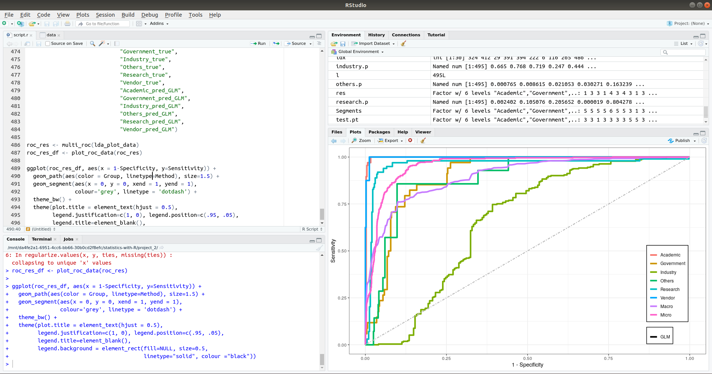
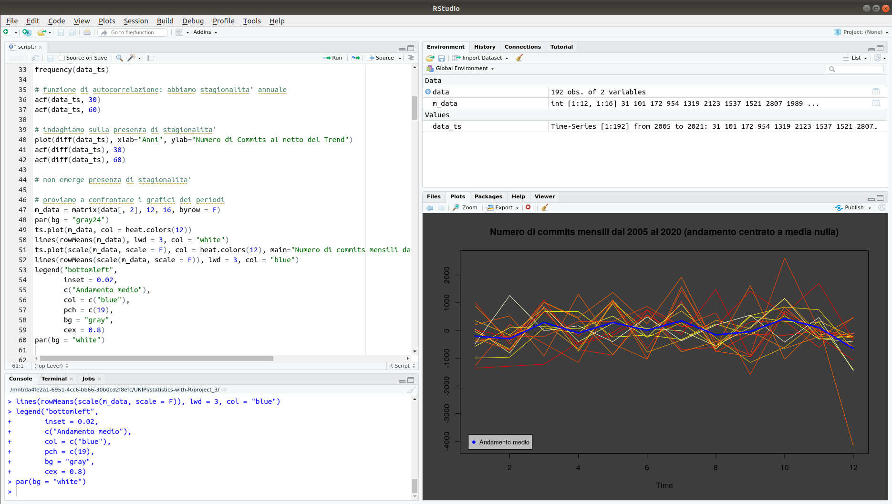

# Statistics Projects using R

Statistics projects using R as part of my MSc in Artificial Intelligence and
Data Mining at University of Pisa.

## Project 1: TOP500 Supercomputers Linear Regression Analysis

## Project 2: TOP500 Supercomputers Classification Analysis

## Project 3: Linux Kernel repository commits Time Series Analysis

